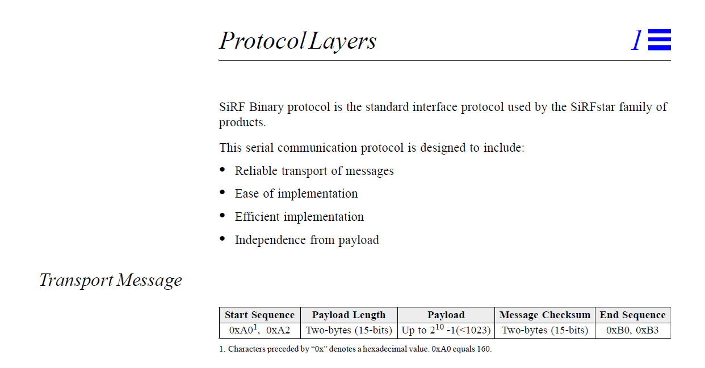
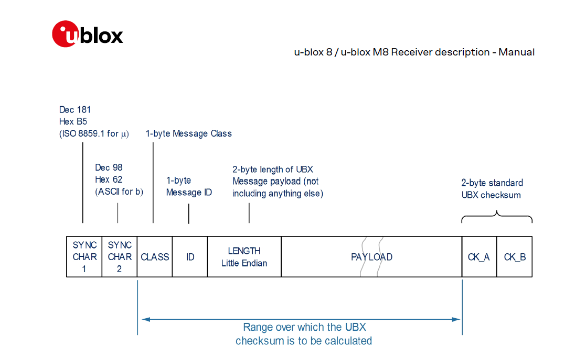
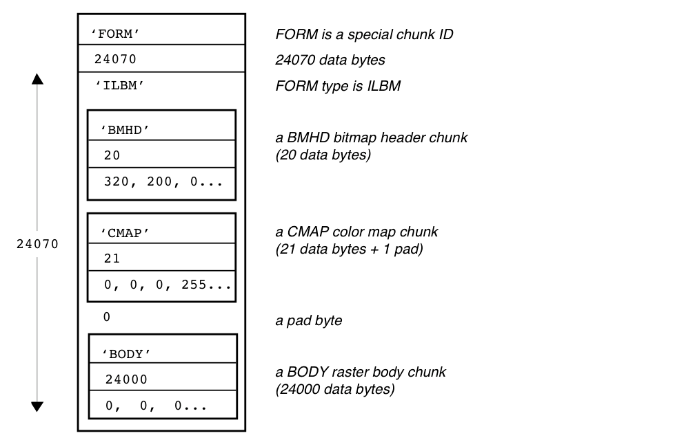
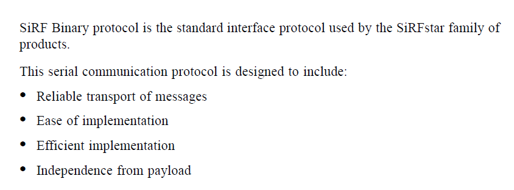
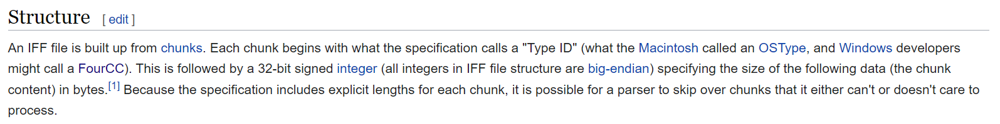
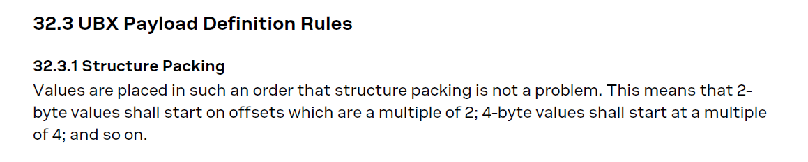

## Open GNSS - Minutiae

### Introduction

This document has been created to explain some of the minutiae of the proposed format and the rational for some of the (seemingly) trivial details which are actually at the heart of the proposal. The initial "[thoughts](thoughts.md)" document was more about the "how" than it was about the "why".

I got involved in this project due to an extensive software development background, dating back to the Atari ST and Commodore Amiga in the late 1980s. These 68000-based platforms exposed me to some really well-designed file formats, especially the [IFF](https://en.wikipedia.org/wiki/Interchange_File_Format) format which was a widely used [container format](https://en.wikipedia.org/wiki/Container_format) for images and audio. Primarily an assembly language programmer at the time, it was blatantly clear why many of the design decisions had been made in the IFF container format. I also started writing in C in the late 80's and it was easy to see what was really happening at an assembly level.

There are many subtleties about processor architectures of which many modern day programmers will be unaware, especially when using languages such as Java and C++. The importance of things like structure packing / memory alignment are often unfamiliar to modern day programmers, but they are nevertheless still very important. Some of these considerations can be seem rather alien, even to relatively experienced programmers but ultimately they are still important. This is especially true when designing an open format for use on any processor architecture and with any GNSS chipset, either now or in the future.

Some of these core principles (especially structure packing) are clearly evident in the majority of well-designed file formats. The u-blox binary protocol is a good example with carefully consideration given to structure packing, although the casual observer may be forgiven for not noticing it.

### Container Formats

A good container format has many benefits but one of the nicest aspects is that you can easily skip through a file even if you do not understand all of the content. Container formats are incredibly prevalent with two obvious examples in the world of global positioning being the SiRF binary protocol and UBX protocol.

#### SiRF Binary Protocol

The image below shows the structure of transport messages, including the following key items:

- Payload length
- Payload
- Checksum

SiRF chose to put the message ID inside the payload itself. Many popular container formats chose to store such an ID outside of the payload.

#### UBX Protocol

The UBX frame structure is shown below, and it is easy to see the key similarities with the SiRF protocol:

- Message class and ID are outside of the payload
- Payload length
- Payload
- Checksum

#### Interchange File Format (IFF)

The [IFF](https://en.wikipedia.org/wiki/Interchange_File_Format) format was mentioned in the intro. Despite dating back to 1985 it's actually more powerful than simple frame-based systems because it is based on "chunks" and chunks can be embedded. I have an attachment to this format because way back it introduced me to container formats. 

The example below doesn't show embed chunks, making it relevant to what we are trying to achieve. It does however illustrate the following:

- Type ID appears outside of the payload and identifies chunks (aka [FourCC](https://en.wikipedia.org/wiki/FourCC))
- Payload sizes are provided
- Absence of checksums

It is also worth noting the pad byte between the CMP and BODY chunks, which relates to address alignment. IFF was created in the era of 16-bit machine architectures and hence the need for the payload sizes to be aligned to even memory locations.

#### Container Format Summary 

Three formats have been quickly presented but with minimal explanation; SiRF binary protocol, UBX protocol and the Interchange File Format (IFF).

I've worked with countless other file formats over the years (including writing binary-level database engines), all of which use the same core principles:

- Identifier
- Payload length
- Payload
- Checksum

Lengths are always for the payload alone whereas checksums may be for the payload alone or include the identifier and length. Checksums will appear at the end if they include the identifier and the length or possibly at the beginning if they only include the payload. Checksums always apply to a contiguous region of memory.

#### Why use a Container Format?

I'd like to think that the benefits are clear but SiRF summarised it quite nicely:

The Wiki page for IFF also describes the befits of being able to skip unfamiliar chunks in the IFF format:

This is a hugely beneficial property of all container formats and ensures forward compatibility.

Software written today will work with the files created in the future, even if the file format is enhanced in the interim.

The size of a chunk / frame may seem almost redundant in some scenarios but it is guaranteed to be future proof.

### Machine Architecture

There are many machine architectures with notable differences being their byte ordering (aka [endianness](https://en.wikipedia.org/wiki/Endianness)) and whether the CPU is a 8 / 16 / 32 / 64 bit architecture. Even two 16-bit CPUs from different manufacturers can have very different memory costraints.

Anyone who has written low-level C code that has been ported to multiple platforms / architectures may have experienced a lot of headaches, especially when handling where the processing of file formats is concerned.

This is just something that I have learnt from decades of experience and why I have given different machine architectures careful consideration, whilst proposing an open format. We have no idea what hardware might use the open format in the future so it is best to do things "properly".

#### Structure Packing

This is kind of a "forgotten art" but it is still as important today as it was 30 years ago. This is especially important when devising an open format for a wide variety of possible machine architectures. Different microcontrollers and GNSS chipsets will vary today and ones in the future could also have different architectures. It is easy to make poor assumptions based on the experiences of just one or two architectures.

I'm not going to write a full article about memory alignment / structure packing but I will provide a couple of links:

- [The Lost Art of Structure Packing](http://www.catb.org/esr/structure-packing/)
- [How important is memory alignment? Does it still matter?](https://softwareengineering.stackexchange.com/questions/328775/how-important-is-memory-alignment-does-it-still-matter)

I'd suggest having a read to gain an overview of what structure packing is and why it can be important, especially for open formats.

#### UBX Structure Packing

It is very clear that the u-blox engineers have given structure packing a great deal of thought in their UBX protocol. It was immediately obvious to me when I first looked at the messages themselves, but it was only when I searched the document that I saw it stated explicitly:

### Open GNSS Design Decisions

I said in the intro of this article that my "[thoughts](thoughts.md)" document was focused primarily on "how" and not "why". Many of the design decisions were based on decades of experience as professional software engineer, primarily writing software for data processing. I have no doubt I that the document will contain some simple oversights but the core aspects of the design are for sound reasons, although they may not be immediately apparent to people with different software development backgrounds.

#### Frames

The frame format that I proposed has a number of qualities:

- I made a conscious decision to keep the identifiers as lightweight as possible; no start and end sequences such as SiRF.
  - I bundled the identifier and the size into the same 2 bytes on the basis that GNSS data tends to be quite small
  - I may have overlooked the size of the raw data captured for RTK / PPK. This was n oversight and may need to be revisited.

- Ability to skip through files containing unfamiliar frame types.
- Length is an absolute must, although it may appear to be "redundant" now.
  - The way that ID and length occupy two bytes is not only a space saving measure but also to ensure byte-alignment of the 16-bit checksum.
  - Future enhancements may render existing software unable to determine frame sizes from enhanced frame definitions.
  - The header includes a [semantic version](https://semver.org/) to allow existing parsers to decide how they should parse the file.
- Structure packing has been given careful consideration so that low-level implementations can avoid the issues caused by badly packed data.
  - Different architectures will enforce different memory constraints which is the primary reason for the focus on structure packing.
  - Without knowing the target architecture, failure to consider structure packing may force programmers to implement sub-optimal code.
  - Ending the payload on an odd / even boundary is not a biggie as people can handle it according, regardless of the target architecture.

#### Frame Definitions

Frame definitions are regular frames with an identifier, size and checksum in the first 4 bytes. The payload is the only "fixed" aspect of the proposed format since it defines the content of the actual data frames. They can be easily skipped because they are regular frames which state their size.

I strongly believe the frame definitions are important, even for a "minimal" format as they ensure forward compatibility.

Should other products (or sports) choose to adopt the open format for their own "minimal" content (e.g. "ts", "lon" and "lat") then software written today; GPSResults, GPS Speedreader, GpsarPro and GPS Wizard will happily be able to process those files without modification.

The aforementioned products may wish to "assume" the structure of minimal files from u-blox devices and simply ignore the frame definitions. That is the choice of each developer but I fully intend to write a reader and writer for the open format that understands the content, regardless of the source.

Excluding a 36 byte frame definition for trackpoint / GNSS frames, simply because some people may not wish to use the definition would be very shortsighted imho. The one-off 36 byte overhead for the frame definition is trivial when considering 100+ bytes per second for the "minimal" GNSS data.

#### Single Format

The motivation for proposing a single flexible format is so that is can be used for pretty much anything, either now or in the future.

A flexible frame based structure does not preclude the option to mandate the "minimal" and "developer" formats for a u-blox based GNSS logger such as the ESP. This option will always be on the table, but I strongly believe that even mandated formats should take note of the topics that I have touched on in this document.

There are huge benefits to using an extensible format, even for "minimal" logs. This is a great opportunity to build something beautiful and not just do a rehash of SBP which is better suited to the ESP requirements and may need to be superseded in the future.

### Summary

It's impossible to cram all of my relevant experiences into a single document and explain the rationale for some core design decisions, without spending hours or days recounting my experiences over the years.

Hopefully this document provides a foundation for understanding why some of the decisions have been made, without me having to dive into specific architectures and low-level optimization techniques. These would be highly problematic without giving consideration to memory packing, for example.

We have identified several immediate "use cases" for an open format and it is my firm belief that they should all be based off the same fundamental file format and design principles. Anyone who wishes to take short-cuts in parsing the files can do so it they so wish.

I don't feel we should take away the main benefits of the open format from those who are willing to put the time and effort into developing a flexible parser. It is an order of magnitude less complicated than alternatives such as FIT, due to various design decisions and compromises. Shared frame definitions were one such decision, proving a compromise between FIT-style flexibility (complexity) and the trivial nature of fixed formats.

This initiative can easily ensure that data frames of the "minimal" format can be easily be read by a "lazy" parser. Such a parser only need skip the frame definitions (easy), skip the header frame (easy), then read the data frames (assuming a fixed format). This really is barely any harder than reading a file in the SBP format. The benefit of using the open format to its fullest is that software can take the "lazy" approach or write a fully-fledged generic parser.

**Addendum**

There are also "in-between" options such as writing a parser that can only handle the specific "endianness" relating to a particular file type - e.g. ESP "minimal". The same could be true of data types that do not match expectations. The software can just say "file type not supported", or suchlike. The key point is that the ESP project can do what they wish with an ESP "minimal" format. A "lazy" parser can be limited to parsing what is expected (perhaps doing a quick sanity check that it is as expected, such as checking the checksum of the trackpoint frame definition) whilst a full-fledged parser will be able to read the data regardless.

